# Meesa Multis Maker

<p align="center">
  <strong>The ultimate tool for creating Ultima Online multi structures and GUMP graphics with AI-powered texture regeneration</strong>
</p>

<p align="center">
  
</p>

<p align="center">
  <a href="#features">Features</a> •
  <a href="https://discord.gg/MpBe7cJDqV">Discord</a>  •
  <a href="#installation">Installation</a> •
  <a href="#getting-started">Getting Started</a> •
  <a href="#main-editors">Editors</a> •
  <a href="#comfyui-integration">ComfyUI Integration</a> •
  <a href="#keyboard-shortcuts">Shortcuts</a> •
  <a href="#license">License</a>
</p>

---

## Overview

**Meesa Multis Maker** is a Windows desktop application for composing, editing, exporting, and AI-regenerating isometric game assets used in Ultima Online-style multis and GUMPs. It provides a powerful canvas for placing item art on an isometric diamond grid with support for complex transforms and integrates AI pipelines (via ComfyUI) for texture and static regeneration.

### System Requirements

- **OS:** Windows 7 or later
- **.NET Framework:** 4.7.2 or later
- **Ultima Online Client:** Required for MUL/UOP asset files
- **ComfyUI Server:** Optional, for AI image generation features

---

## Features

### Isometric Canvas Editor (Main Form)

<p align="center">
  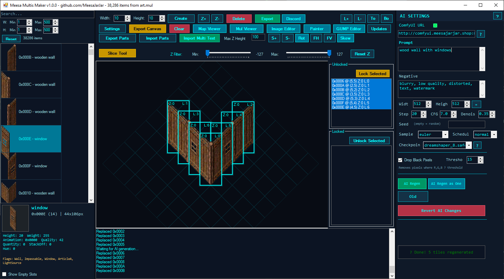
</p>

- **Diamond grid system** - Standard 44x44 pixel Ultima Online tile format
- **Multi-object selection** - Ctrl+Click for multi-select, marquee selection with Ctrl+Drag
- **Z-ordering and layering** - Full control over object depth and draw order
- **Pan & Zoom** - Middle-click pan, Ctrl+Scroll to zoom (0.2x to 4x)
- **Snap-to-grid** - Objects automatically align to isometric grid positions
- **Z-level filtering** - Filter visible objects by Z height range

<p align="center">
  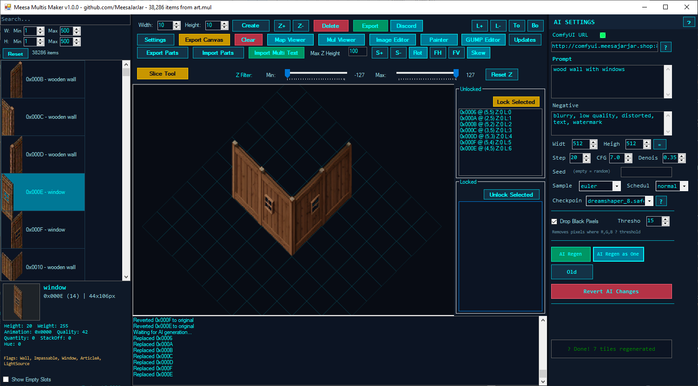
  
</p>

### Transform Tools
- **Scale** - Resize objects (0.1x to 10x) with +/- keys
- **Rotate** - Free rotation with R key, 15 degree or 90 degree snap with Shift/Ctrl
- **Flip** - Horizontal (F) and Vertical (Shift+F) flipping
- **Skew/Distort** - Corner-based perspective transform (K key)
- **Pixel Offset** - Fine-tune positioning with Alt+Arrow keys

### Slice Tool

<p align="center">
  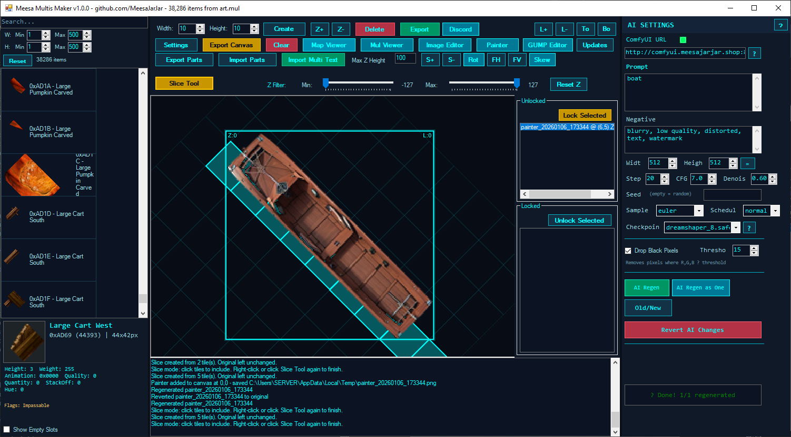
  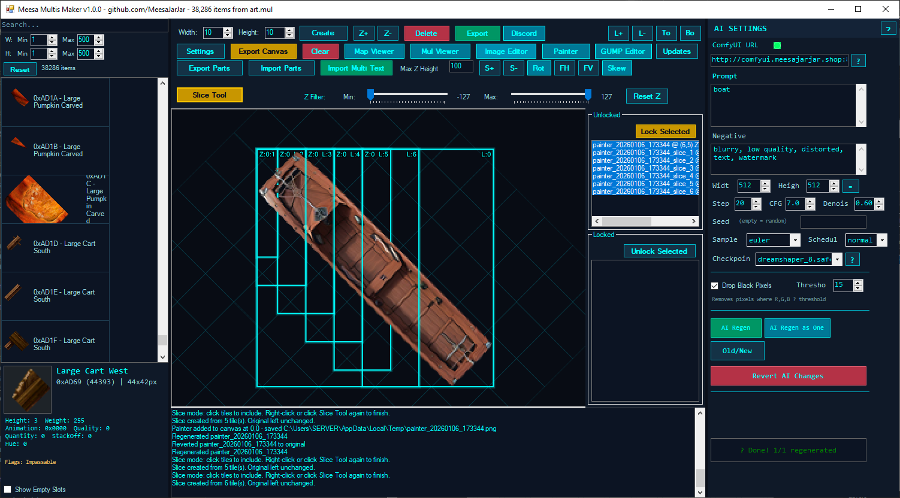
</p>

Create vertical slices of placed images based on selected diamond tiles - perfect for creating building pieces that align perfectly with the isometric grid.

### Lock System
- Lock objects to prevent accidental editing
- Separate locked/unlocked object lists
- Multi-select lock/unlock operations

### AI Integration (ComfyUI)
- **Image-to-Image** - Transform existing sprites with AI
- **Inpainting** - Selective region regeneration with masks
- **Text-to-Image** - Generate new assets from text prompts
- **Batch Processing** - Regenerate multiple selected objects at once
- **Old/New Toggle** - Compare AI-generated results with originals
- **Drop Black Pixels** - Automatic background removal for generated images

### Import/Export
- **Canvas Export** - Save entire canvas as PNG
- **Multi Text Import/Export** - Load/save Ultima Online multi format files
- **Parts Export** - Export individual components for AI processing
- **MUL File Export** - Save directly to Ultima Online asset files

### Settings

<p align="center">
  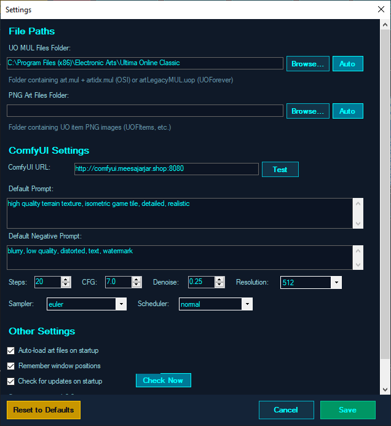
</p>

---

## Main Editors

### Painter Form

<p align="center">
  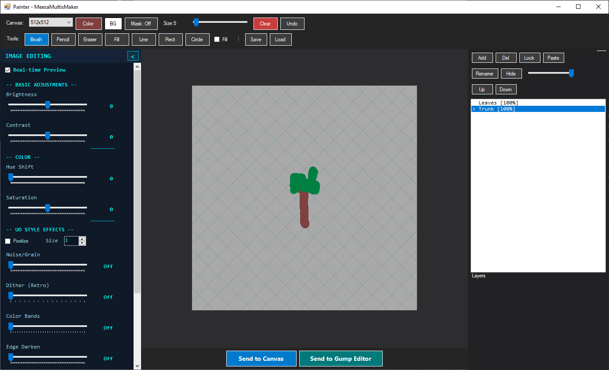
</p>

A full-featured layer-based pixel art editor for creating custom sprites.

<p align="center">
  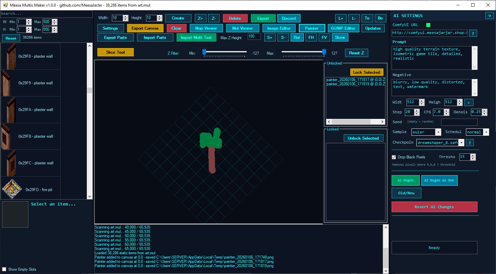
  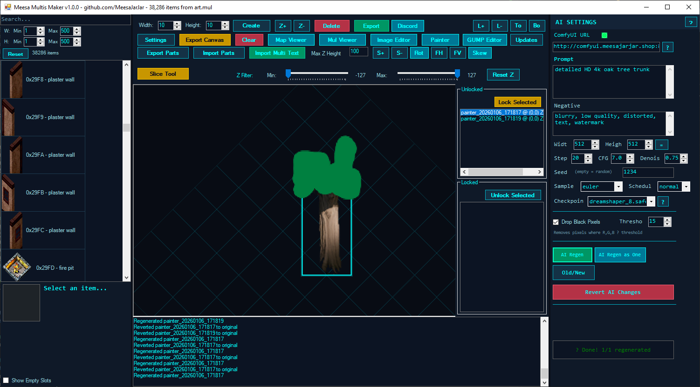
</p>

**Features:**
- **Multiple canvas sizes** - 512x512, 768x768, 1024x1024, 1536x1536
- **Layer system** - Add, delete, reorder, rename, lock, and adjust opacity
- **Drawing tools:**
  - Brush (soft round with anti-aliasing)
  - Pencil (hard pixel-perfect)
  - Eraser
  - Flood fill
  - Line tool
  - Rectangle tool
  - Circle/ellipse tool
- **Fill shapes** - Toggle between outline and filled shapes
- **Mask mode** - Paint masks for AI inpainting
- **Zoom** - Ctrl+Scroll or Ctrl+/Ctrl- to zoom
- **Undo** - Per-layer undo history (Ctrl+Z)
- **Clipboard** - Paste images directly (Ctrl+V)
- **Image effects panel** - Brightness, contrast, hue, saturation, pixelize, noise, dither
- **Send to Canvas** - Export merged image to main form
- **Send to GUMP Editor** - Export to GUMP Editor

<p align="center">
  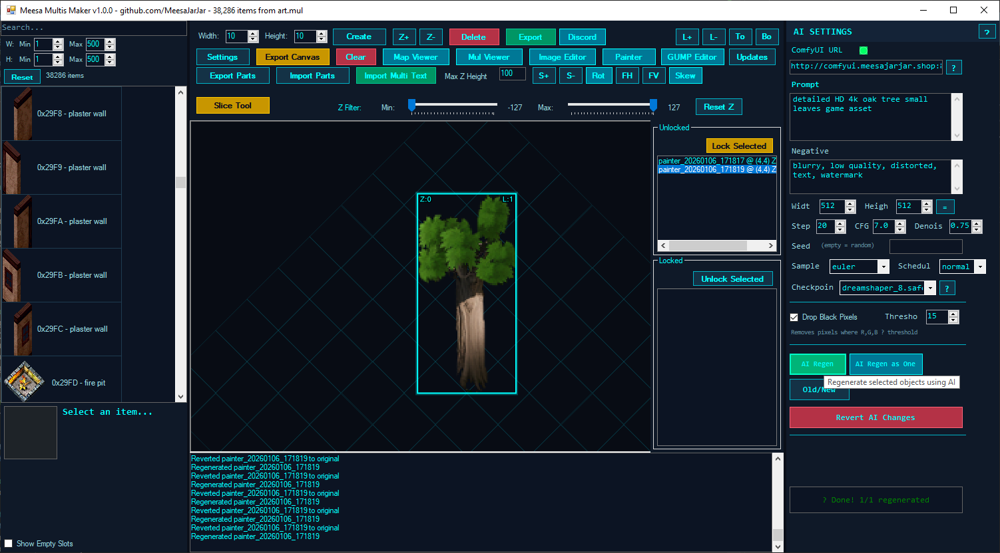
  
</p>

### GUMP Editor

<p align="center">
  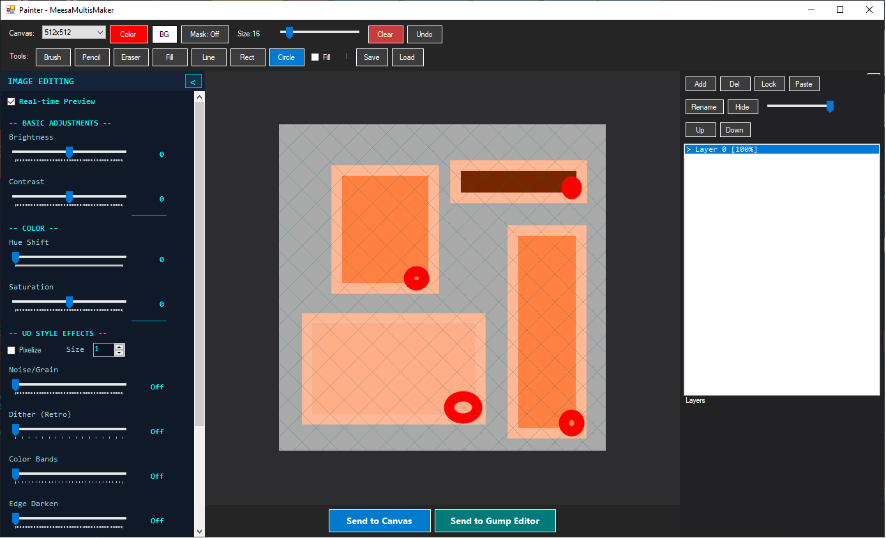
</p>

Specialized editor for Ultima Online UI graphics (GUMPs).

<p align="center">
  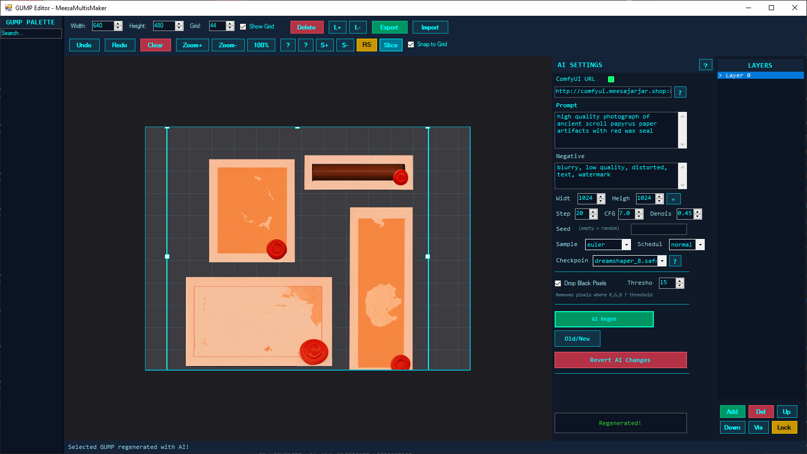
</p>

**Features:**
- **GUMP palette browser** - Search and filter available GUMPs
- **Drag-and-drop placement** - Add GUMPs to canvas
- **Multi-selection** - Select and transform multiple GUMPs
- **Transform tools** - Scale, rotate, skew
- **Layer management** - Organize GUMPs in layers
- **AI regeneration:**
  - Single GUMP regeneration
  - Multi-GUMP combined regeneration (processes as one image, splits result)
  - Alpha mask preservation
  - Black pixel removal
  - Old/New comparison toggle
  - Revert to original
- **Custom image import** - Add PNG images as GUMPs
- **Canvas export** - Save compositions as PNG

### MUL Viewer

<p align="center">
  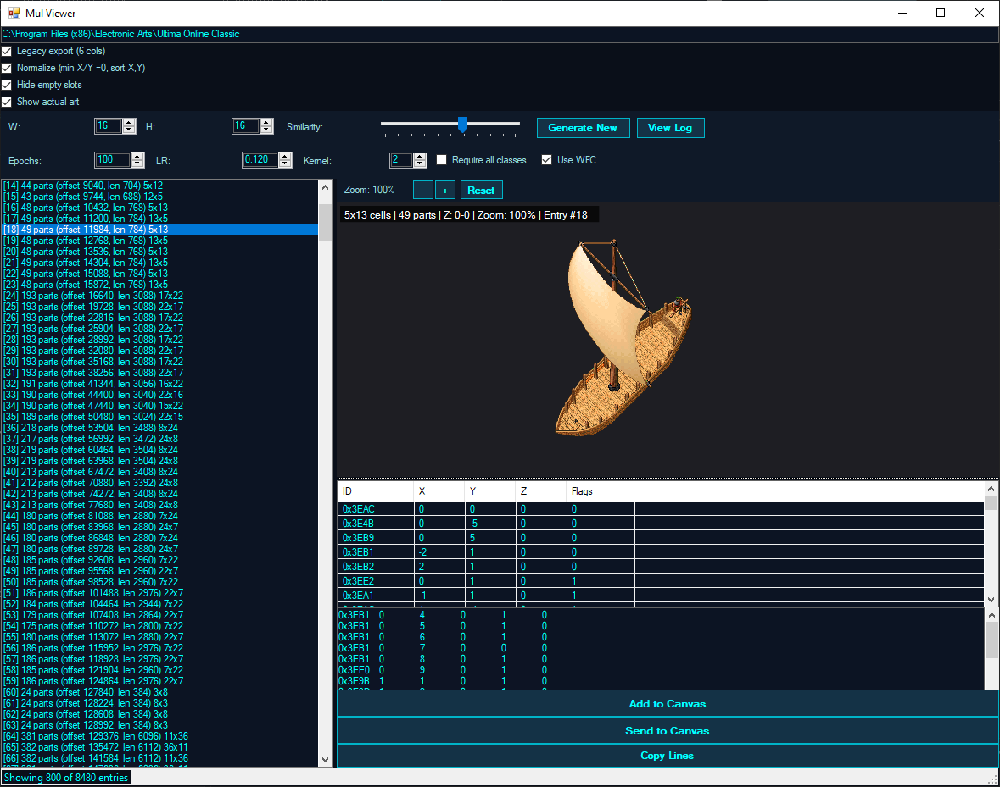
</p>

Browser for viewing and generating multi structures from MUL files.

**Features:**
- **Multi entry browser** - List all multis with dimensions
- **Parts view** - See individual components with TileID, X, Y, Z, Flags
- **Preview rendering** - Isometric preview with pan and zoom
- **Hide empty entries** - Filter out empty multi slots
- **Normalize coordinates** - Center multi at origin
- **Export text format** - Copy multi definition to clipboard
- **Send to Canvas** - Import selected multi to main editor
- **Add to Canvas** - Append multi to existing objects

**Structure Generation (AI-like):**
- Select one or more multis as training data
- Configure output dimensions (width x height)
- Adjust generation parameters:
  - Kernel size
  - Epochs
  - Learning rate
  - Similarity factor
- Choose algorithm:
  - Neural network (SimpleCnn)
  - Wave Function Collapse (WFC)
- Generate new structures based on learned patterns

### Image Editor

<p align="center">
  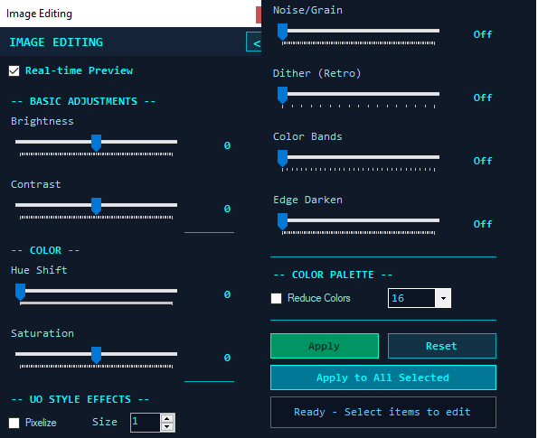
</p>

Quick image effects editor for adjusting brightness, contrast, and applying filters to selected objects.

### Map Viewer
World map browser with tile/static editing and AI replacement.

**Features:**
- **Facet selection** - Browse Felucca, Trammel, Ilshenar, Malas, Tokuno, Ter Mur
- **Pan and zoom** - Navigate large maps efficiently
- **Minimap generation** - Overview of entire map
- **Coordinate navigation** - Jump to specific X,Y location
- **Selection modes:**
  - Land tiles
  - Statics
  - Lasso selection for irregular areas
- **Z-level filtering** - Show statics within Z range
- **Static manipulation:**
  - Move with numpad keys (X, Y, Z)
  - PageUp/PageDown for Z adjustment
- **AI tile replacement:**
  - Replace mode - Simple regeneration
  - Context mode - Context-aware inpainting
  - Batch processing of selected tiles
- **Show statics toggle** - View map with or without statics
- **TileData display** - View item properties

---

## Screenshots Gallery

<p align="center">
  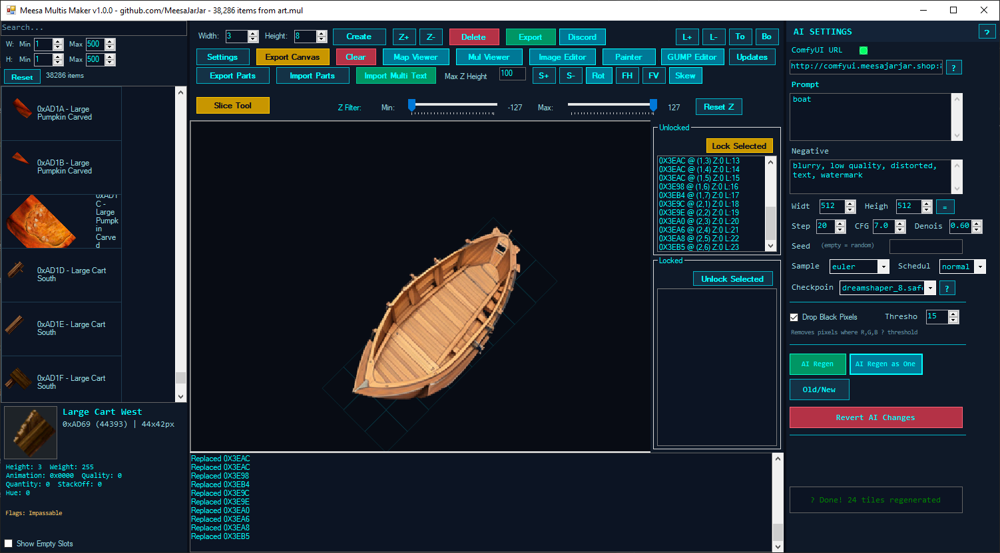
  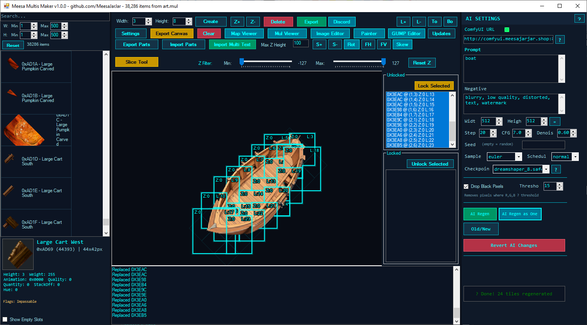
</p>

---

## Installation

### Download
1. Download the latest release from the [Releases page](https://github.com/MeesaJarJar/MeesaMultisMaker/releases)
2. Extract the ZIP file to a folder of your choice
3. Run `MeesaMultisMaker.exe`

### First Launch
1. Accept the license agreement
2. Browse to your Ultima Online installation folder when prompted
   - The application will search common paths automatically:
     - `C:\Program Files (x86)\Electronic Arts\Ultima Online Classic`
     - `C:\Program Files (x86)\UOForever\UO`
     - And other common locations

### Supported Asset Formats
- **MUL Files** - Standard OSI format (`art.mul` + `artidx.mul`)
- **UOP Files** - Enhanced format (`artLegacyMUL.uop`)
- **PNG Art Folders** - UOFItems-style PNG directories

---

## Getting Started

### Basic Workflow

1. **Load Assets** - Click "MUL Folder..." to select your Ultima Online installation
2. **Browse Palette** - Use the left panel to search and browse available art
3. **Place Objects** - Drag items from the palette onto the canvas
4. **Transform** - Select objects and use transform tools to position them
5. **Export** - Save your creation using the Export button

### Creating a Multi Structure

1. Set grid size using Width/Height controls (e.g., 10x10)
2. Click "Create Grid" to initialize the canvas
3. Drag foundation pieces from the palette
4. Add walls, set appropriate Z levels with Z+/Z- buttons
5. Layer decorations using L+/L- for draw order
6. Export as Multi Text for use in-game

---

## ComfyUI Integration

Meesa Multis Maker integrates with [ComfyUI](https://github.com/comfyanonymous/ComfyUI) for AI-powered image generation and transformation.

### What is ComfyUI?

ComfyUI is a free open source framework that serves as a bridge that allows users to use the latest technology that exists in the art generation field. It runs on Windows well and uses your local GPU to allow you to generate art completely free from API costs.

**Official Website:** https://www.comfy.org/

ComfyUI has both a Desktop and a Portable version. The Portable version is recommended.

### Setting Up ComfyUI

#### Option 1: Google Colab (Free, No GPU Required!)

ComfyUI can run in Google Colab notebooks for free using their T4 free GPUs, allowing you to generate artwork without needing a good GPU at all!

**Step 1.** Go to https://colab.research.google.com/

**Step 2.** Click "New notebook" button.

**Step 3.** Paste this script into the notebook cell:

```python
!git clone https://github.com/comfyanonymous/ComfyUI.git
!cd ComfyUI
!pip install -r requirements.txt
!pip install pinggy
!mkdir -p models/checkpoints
!wget -O models/checkpoints/sd_xl_base_1.0.safetensors \
https://huggingface.co/stabilityai/stable-diffusion-xl-base-1.0/resolve/main/sd_xl_base_1.0.safetensors?download=true

!wget -O /content/ComfyUI/models/checkpoints/dreamshaper_8.safetensors \
https://huggingface.co/jzli/DreamShaper-8/resolve/main/dreamshaper_8.safetensors

import pinggy

tunnel = pinggy.start_tunnel(forwardto="localhost:8188")

print("Public URL(s):")
for url in tunnel.urls:
    print(url)

!python main.py --listen 0.0.0.0
```

**Step 4.** Click the Play button to run the script.

**Step 5.** If all works well, about halfway down the output you will see something like this:

```
Public URL(s):
http://eyzzg-33-125-104-65.a.free.pinggy.link
https://eyzzg-33-125-104-65.a.free.pinggy.link
```

These are public-facing endpoints that allow MeesaMultisMaker to connect to this Google Colab notebook.

**Step 6.** Copy one of those URLs and paste it into the ComfyUI URL field in MeesaMultisMaker (top right corner of the AI Settings panel). **Add `:80` to the end of the URL** since the Google Colab setup uses port 80.

Example: `http://eyzzg-33-125-104-65.a.free.pinggy.link:80`

> **Note:** This Colab notebook automatically terminates when you stop using it, so you will have to run this script each time you want to use the AI features.

#### Option 2: Run Your Own ComfyUI Server (Local)

1. **Install ComfyUI**
   ```bash
   git clone https://github.com/comfyanonymous/ComfyUI
   cd ComfyUI
   pip install -r requirements.txt
   ```

2. **Download Required Models**
   Place these in your ComfyUI `models/checkpoints` folder:
   - **DreamShaper 8** - `dreamshaper_8.safetensors` (recommended for most generation)
   - **SD 1.5** - `v1-5-pruned-emaonly.ckpt` (for inpainting)

   Download from [Civitai](https://civitai.com/models/4384/dreamshaper) or [Hugging Face](https://huggingface.co/runwayml/stable-diffusion-v1-5)

3. **Start ComfyUI**
   ```bash
   python main.py --listen 0.0.0.0 --port 8080
   ```

4. **Configure in Meesa Multis Maker**
   - Open Settings or the AI Settings panel
   - Set ComfyUI URL to `http://localhost:8080`
   - Click "Test Connection" to verify

#### Option 3: Use the Public Server

The application is pre-configured to use `http://comfyui.meesajarjar.shop:8080`. However, MeesaJarJar only runs this server occasionally upon request, so the Google Colab option or running your own server is recommended.

### AI Workflows

#### Text-to-Image Generation
Generate new sprites from text descriptions:
1. Open the AI Image Generator (Painter or standalone)
2. Enter a positive prompt (e.g., "isometric stone wall, medieval, detailed")
3. Optionally add negative prompts to exclude unwanted elements
4. Adjust parameters:
   - **Steps:** 15-30 (higher = more detail, slower)
   - **CFG Scale:** 6-8 (higher = stricter prompt adherence)
   - **Sampler:** `euler` or `euler_ancestral` recommended
5. Click "Generate"

#### Image-to-Image Transformation
Transform existing sprites with AI:
1. Select objects on the canvas
2. Set denoise strength (0.2-0.5 for subtle changes, 0.6-0.8 for significant changes)
3. Enter a prompt describing the desired result
4. Click "Regenerate Selected"

#### Inpainting
Selectively regenerate portions of an image:
1. In Map Viewer or Painter, enable mask mode
2. Paint over areas you want to regenerate (white = regenerate)
3. Enter a prompt for the new content
4. Run the inpainting workflow

### AI Settings Panel Options

| Setting | Description | Default |
|---------|-------------|---------|
| ComfyUI URL | Server address | `http://comfyui.meesajarjar.shop:8080` |
| Prompt | Positive prompt for generation | (varies) |
| Negative Prompt | Elements to avoid | "blurry, low quality..." |
| Steps | Denoising steps | 20 |
| CFG Scale | Prompt adherence | 7.0 |
| Denoise | Transformation strength | 0.25-0.73 |
| Sampler | Sampling method | euler |
| Scheduler | Noise schedule | normal |
| Resolution | Output size | 512x512 |
| Drop Black Pixels | Remove dark backgrounds | Enabled |
| Black Threshold | Darkness cutoff for removal | 15 |

### Recommended Generation Settings

| Use Case | Steps | CFG | Denoise | Sampler |
|----------|-------|-----|---------|---------|
| Quick Preview | 15 | 6 | 0.3 | euler |
| Standard Quality | 20 | 7 | 0.4 | euler_ancestral |
| High Quality | 30 | 7.5 | 0.5 | dpmpp_2m |
| Inpainting | 20 | 7 | 0.73 | ddpm |

### Prompting Tips

**Good prompts for UO-style assets:**
- "isometric game tile, pixel art style, [object description], clean background"
- "3d model isometric view, [object], black background, studio lighting"
- "ultima online style, medieval fantasy, [object]"

**Negative prompt suggestions:**
- "blurry, low quality, distorted, text, watermark, signature"
- "modern, sci-fi, photo-realistic" (if you want stylized results)

---

## Keyboard Shortcuts

### Canvas Navigation
| Key | Action |
|-----|--------|
| Middle Mouse | Pan canvas |
| Ctrl + Scroll | Zoom in/out |
| Escape | Exit current mode (Slice/Skew/Rotate) |

### Selection
| Key | Action |
|-----|--------|
| Click | Select single object |
| Ctrl + Click | Add/remove from selection |
| Ctrl + Drag | Marquee select |
| Alt + Drag | Marquee deselect |

### Object Manipulation
| Key | Action |
|-----|--------|
| Delete | Delete selected objects |
| Numpad 1-9 | Move in grid directions |
| Alt + Arrows | Pixel offset (fine movement) |
| Alt + Shift + Arrows | Fast pixel offset |

### Transforms
| Key | Action |
|-----|--------|
| + / - | Scale up/down |
| Shift + +/- | Scale faster |
| R | Toggle rotate mode |
| Shift + R | Rotate 15 degrees |
| Ctrl + R | Rotate -90 degrees |
| F | Flip horizontal |
| Shift + F | Flip vertical |
| K | Toggle skew mode |
| Shift + K | Reset skew |
| Ctrl + T | Reset all transforms |

### Editing
| Key | Action |
|-----|--------|
| Ctrl + C | Copy selection |
| Ctrl + V | Paste at cursor |
| Ctrl + Z | Undo |
| Ctrl + Y | Redo |
| H | Hide selected objects |
| Shift + H | Show all hidden objects |

### Map Viewer (Statics Selected)
| Key | Action |
|-----|--------|
| Numpad 8 | Move X-1, Y-1 |
| Numpad 2 | Move X+1, Y+1 |
| Numpad 4 | Move X-1, Y+1 |
| Numpad 6 | Move X+1, Y-1 |
| Numpad 7 | Move X-1 |
| Numpad 9 | Move Y-1 |
| Numpad 1 | Move Y+1 |
| Numpad 3 | Move X+1 |
| Page Up / + | Move Z+1 |
| Page Down / - | Move Z-1 |
| Escape | Cancel lasso selection |

### Painter
| Key | Action |
|-----|--------|
| Ctrl + Z | Undo (per-layer) |
| Ctrl + V | Paste image as layer |
| Ctrl + N | Add new layer |
| Ctrl + +/- | Zoom in/out |
| Ctrl + 0 | Reset zoom |

---

## Configuration

Settings are stored in:
```
%APPDATA%\MeesaMultisMaker\config.xml
```

### Configurable Options
- MUL folder path
- PNG art folder path
- ComfyUI server URL
- Default AI generation parameters (prompt, steps, CFG, denoise, sampler, scheduler, resolution)
- Update check preferences
- Window position preferences

---

## Troubleshooting

### Common Issues

**"Parameter is not valid" error on images**
- This can occur if image data becomes corrupted. Try reloading the application.
- Ensure your MUL files are not corrupted.

**ComfyUI connection fails**
- Verify ComfyUI is running and accessible
- Check firewall settings
- Ensure the URL includes the port (e.g., `http://localhost:8080`)
- For Google Colab, make sure to add `:80` to the pinggy URL
- Test with "Test Connection" button

**Missing art/textures**
- Verify the MUL folder path in settings
- Check that `art.mul` and `artidx.mul` exist (or `artLegacyMUL.uop` for UOP format)

**AI generation produces black images**
- Ensure the required checkpoint models are installed in ComfyUI
- Check ComfyUI console for error messages
- Enable "Drop Black Pixels" option
- Adjust the "Black Threshold" if needed

**Multi generation produces empty results**
- Select at least one multi entry as training data
- Ensure selected multis have components
- Try adjusting kernel size and epochs

**Google Colab session disconnects**
- Free Colab sessions have time limits and will disconnect after inactivity
- Simply re-run the script to start a new session
- You'll get a new pinggy URL each time

### Getting Help

- **GitHub Issues:** [Report bugs or request features](https://github.com/MeesaJarJar/MeesaMultisMaker/issues)
- **Discord:** [Join our community server](https://discord.gg/MpBe7cJDqV) for support and sharing creations

---

## File Formats

### Multi Text Format
Tab-separated values with columns:
```
TileID  X   Y   Z   Flags
0x0001  0   0   0   1
0x0002  1   0   0   1
```

### Supported Image Formats
- PNG (recommended for transparency)
- BMP
- JPG/JPEG
- GIF

### MUL Files Used
- `art.mul` / `artidx.mul` - Item and land art
- `artLegacyMUL.uop` - UOP format art
- `gumpart.mul` / `gumpidx.mul` - UI graphics
- `map*.mul` - World map data
- `statics*.mul` / `staidx*.mul` - Static objects
- `multi.mul` / `multi.idx` - Multi structures
- `tiledata.mul` - Item properties

---

## Credits

- **Developer:** MeesaJarJar
- **ComfyUI:** [comfyanonymous](https://github.com/comfyanonymous/ComfyUI)
- **Stable Diffusion:** [Stability AI](https://stability.ai/)
- **DreamShaper:** [Lykon](https://civitai.com/user/Lykon)

---

## License

This software is provided as **freeware** for personal and commercial use. See the [LICENSE](LICENSE) file for full terms.

**Key Points:**
- Free to use for any lawful purpose
- Free to redistribute (unmodified, with license)
- No reverse engineering or modification
- No warranty provided
- Author not liable for damages

---

## Contributing

While the source code is not open for modification per the license, we welcome:
- Bug reports via GitHub Issues
- Feature requests and suggestions
- Community tutorials and guides
- Sharing your creations!

---

<p align="center">
  <strong>Made with love for the Ultima Online community</strong>
</p>

<p align="center">
  Copyright 2024-2026 MeesaJarJar. All rights reserved.
</p>
